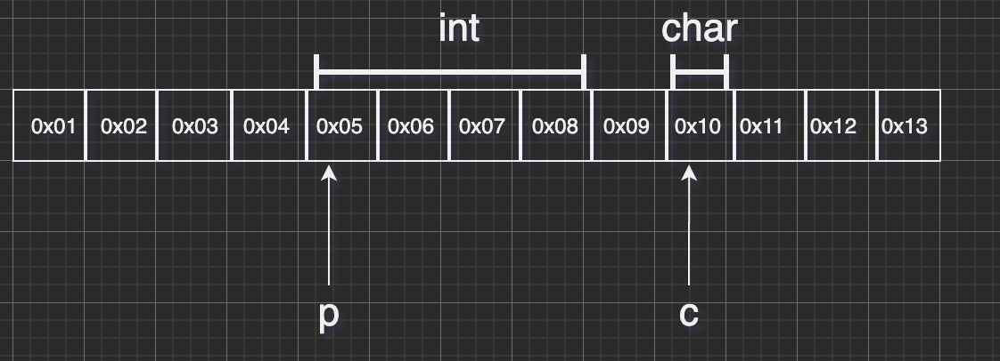

## C语言指针

本文不讲基础，重点是总结，基础知识参考 [基础概念](http://c.biancheng.net/view/1990.html)

**介绍**

* 指针也是变量，不过它表示一个内存地址，是对内存区域的抽象


**本质**

* 定义一个整形指针`int *p = &a;`  p 指向一个内存地址，int表示需要解析4个字节
* 定义一个整形指针`int *c = &b;`  p 指向一个内存地址，char 表示需要解析1个字节

```c
#include <stdio.h>
#include <string.h>

int main()
{
    int a = 100;
    int *p = &a;

    char b = 'c';
    char *c = &b;

    printf("%d \n", *p);
    printf("%c \n", *c);
}
```



上图表示的是指针在内存中的布局，指针由`*` + `地址`+`类型`

`* ` 表示是一个指针 

`地址` 表示变量在内存中起始地址

`类型` 表示要从内存中解析几个字节单元


**总结**

* `int *p` 定义了一个指针，通过`int`标识为整形类型的指针，这样编译器就能识别出内存结构为4个字节
* 指针的内容是地址，指针的类型描述了这个地址所占用的内存空间，所以我们可以通过`+\-`来操作指针获取数据
* 所以指针变量+1，并不是真的加1，而是加1*sizeof(指针类型)
* 内存中每个字节都有一个地址，整个内存是有序排列的，地址从0依次增加。所以指针有了类型，`char*`、`int*`,编译器就可以知道按照一个字节还是4个字节来解析内存的数据


**精髓**

* 通过指针能实现所谓的“传引用”而不是“传值”，本质上节约了数据传输性能
* 指针的运算（对指针加减，甚至取指针）才是c类语言强大的地方


**缺点**

* 指针、无越界检查等等是一切痛苦的根源


